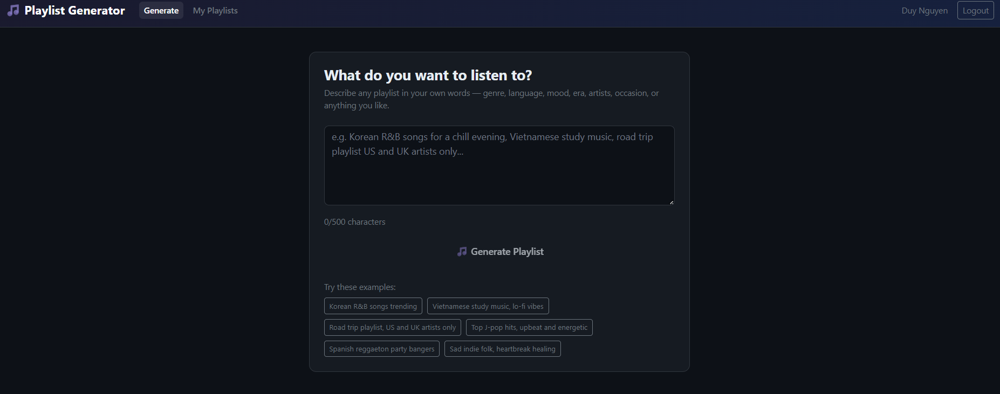
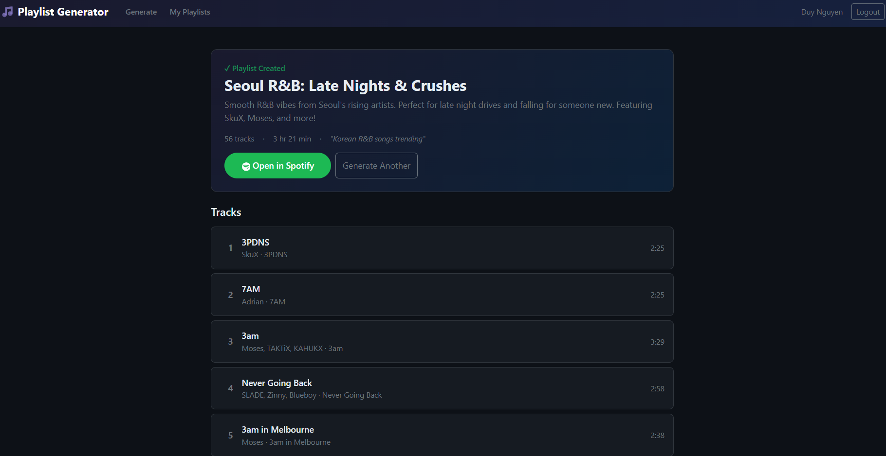
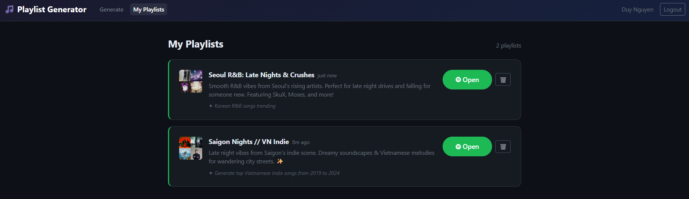

# 🎵 Spotify Playlist Generator

An AI-powered Spotify playlist generator. Describe what you want to listen to in plain English — the app uses Google Gemini to interpret your request, generate targeted Spotify search queries, filter results strictly against your intent, and create a real playlist directly in your Spotify account.

---

## Features

- **Natural language requests** — describe any playlist in your own words
- **AI-powered search** — Gemini generates 10 targeted Spotify search queries per request
- **Strict genre/region filtering** — Gemini cross-checks every track against the request using its world knowledge of artists (not just metadata)
- **Playlist history** — all generated playlists are saved and viewable with cover art
- **One-click delete** — remove playlists from both the app history and Spotify

---

## Prerequisites

- Java 21+
- Node.js 20+
- Docker (for local PostgreSQL)
- A spotify premium account
- [Spotify Developer App](https://developer.spotify.com/dashboard) (free)
- [Google AI Studio API key](https://aistudio.google.com/) (free tier available)

---

## Screenshots





---

## How It Works

```
User types a request
        │
        ▼
Gemini: extract intent → generate 10 Spotify search queries
        │
        ▼
Spotify: search each query → up to 100 raw track candidates
        │
        ▼
Gemini: filter tracks — keep only artists that match the requested region/genre
        │
        ▼
        ┌─ while (tracks < 30 && passes < 3)
        │    Gemini: new queries targeting different artists
        │    Spotify: search again → filter → merge
        └─ break when target met or no new tracks found
        │
        ▼
Gemini: refine playlist title + description from actual tracks found
        │
        ▼
Spotify: create playlist → add tracks → fetch cover image
        │
        ▼
Save to DB → return to user
```

---

## Local Development

### 1. Clone the repo

```bash
git clone https://github.com/your-username/project-playlist.git
cd project-playlist/playlist-generator
```

### 2. Configure environment variables

```bash
cp .env.example .env
```

Fill in `application.properties`:

```env
SPOTIFY_CLIENT_ID=your_spotify_client_id
SPOTIFY_CLIENT_SECRET=your_spotify_client_secret
SPOTIFY_REDIRECT_URI=http://127.0.0.1:8080/api/auth/callback
GEMINI_API_KEY=your_gemini_api_key
DATABASE_USERNAME=user
DATABASE_PASSWORD=password
```

In your Spotify Developer Dashboard, add `http://127.0.0.1:8080/api/auth/callback` as a Redirect URI.

### 3. Start PostgreSQL

```bash
docker compose up -d postgres
```

### 4. Start the backend

```bash
./mvnw spring-boot:run
```

### 5. Start the frontend (hot reload)

```bash
cd frontend
npm install
npm run dev
```

The Vite dev server runs on `http://localhost:5173` and proxies `/api/*` to the Spring Boot backend on port 8080.

---

## Building for Production

The frontend is compiled into `src/main/resources/static/` so the Spring Boot JAR serves the full app as a single artifact.

```bash
# Build frontend into Spring's static folder
cd frontend
npm run build

# Build the JAR
cd ..
./mvnw clean package -DskipTests
```

Run the JAR:

```bash
java -jar target/playlist-generator-*.jar
```

---

## License

MIT
